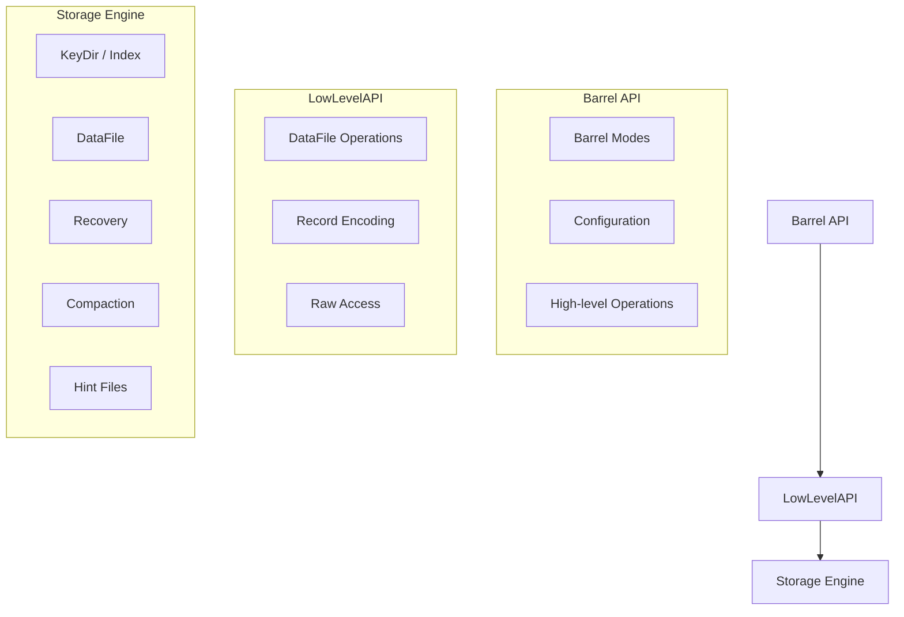
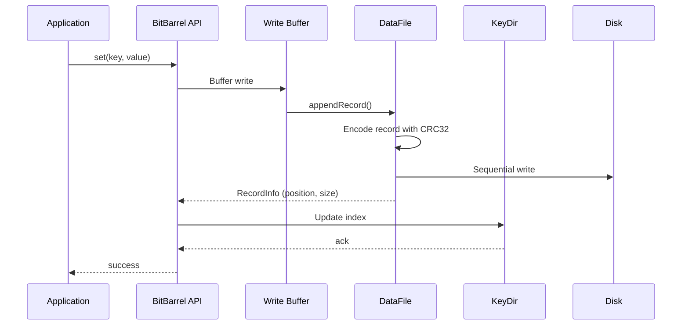
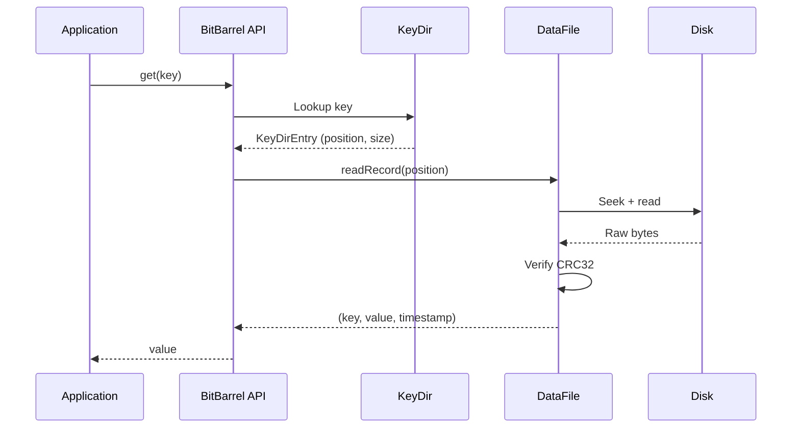

# BitBarrel: Modern Bitcask for High-Performance Key-Value Storage

## Introduction

BitBarrel is a high-performance key-value storage engine written in Nim that brings the classic Bitcask design into the modern era. It combines the simplicity and speed of the original Bitcask model with advanced features like configurable durability, multiple index modes, and background compaction.

At its core, BitBarrel solves a simple problem: how to store and retrieve key-value pairs with good performance and minimum complexity. By embracing an append-only design with an in-memory index, BitBarrel provides reliable storage with ~553 writes/sec and ~98,000 reads/sec on commodity hardware while maintaining crash safety and data integrity. Performance varies significantly based on sync mode, buffer configuration, and workload characteristics.

## The Bitcask Heritage

### Origins of Bitcask

Bitcask was originally developed by Basho Technologies for the Riak distributed database. The design emerged from a simple observation: for many workloads, an append-only log with an in-memory hash index could provide better performance than traditional B-tree based storage engines.

The original Bitcask paper outlined several key principles:

1. **O(1) Disk Reads**: Each key maps to an exact disk location via an in-memory hash table. Reads require exactly one disk seek.

2. **Append-Only Writes**: All writes append to a single active file, enabling sequential I/O and eliminating random writes.

3. **Simplified Design**: No complex buffer management, no B-tree balancing, no write-ahead logging. Just a log file and a hash table.

4. **Deterministic Behavior**: Simple semantics make it easy to reason about performance and behavior under various conditions.

### Limitations of Original Bitcask

While elegant, the original Bitcask had several limitations:

- **Single Hash Index**: Only supports simple key lookups, no range queries or ordered iteration
- **Memory Constraints**: All keys must fit in memory
- **Stop-the-World Compaction**: The database must be taken offline to reclaim space from deleted/overwritten keys
- **Limited Durability Options**: Few choices for trading performance vs durability
- **No Built-in Integrity Checking**: Corrupted records could go undetected

## BitBarrel's Evolution

BitBarrel builds on Bitcask's foundation while addressing its limitations and adding modern features.

### Three Index Modes

Unlike Bitcask's single hash index, BitBarrel offers three distinct "barrel modes" optimized for different workloads:

#### bmNormal: The Classic Hash Table

The traditional Bitcask approach—O(1) lookups via hash table. Perfect for simple key-value operations where ordering isn't needed.

```nim
import bitbarrel
from bitbarrel/types import BarrelMode

var cfg = defaultBarrelConfig()
cfg.mode = BarrelMode.bmNormal  # Explicitly set hash mode

var db = openBarrel("sessions.db", cfg)
db.set("session:abc123", "{userId: 42, lastSeen: 1234567890}")
let session = db.get("session:abc123")
```

**Use case**: Session storage, caching, general-purpose KV operations
**Performance**: O(1) lookup, ~40 bytes per key memory overhead

#### bmCritBit: Sorted with Range Queries

Uses Nim's CritBitTree to maintain keys in sorted order, enabling range queries and prefix searches while keeping all data in memory.

```nim
var cfg = defaultBarrelConfig()
cfg.mode = BarrelMode.bmCritBit

var tsDb = openBarrel("timeseries.db", cfg)

# Store hourly readings
discard tsDb.set("temp:2024-01-15T10:00", "23.5")
discard tsDb.set("temp:2024-01-15T11:00", "24.1")
discard tsDb.set("temp:2024-01-15T12:00", "24.8")

# Get all readings from Jan 15
let readings = tsDb.keysInRange("temp:2024-01-15", "temp:2024-01-16")

# Count humidity sensors without loading values
let count = tsDb.countWithPrefix("humidity:")
```

**Use case**: Time-series data, leaderboards, ordered traversal
**Performance**: O(k) lookup where k is key length, supports range queries

#### bmRanged: Lazy-Loaded Partitions

For datasets larger than memory, bmRanged partitions keys across configurable ranges, loading only active partitions into memory.

```nim
var cfg = defaultBarrelConfig()
cfg.mode = BarrelMode.bmRanged
cfg.numRanges = 100      # 100 hash partitions
cfg.maxLoadedRanges = 10  # Keep 10 in memory

var analyticsDb = openBarrel("analytics.db", cfg)

# Store billions of events—only active partitions stay in memory
discard analyticsDb.set("event:user:12345:click:1234567890", "{url: /product/42}")
discard analyticsDb.set("event:user:67890:view:1234567891", "{url: /category/electronics}")

# Partition stats
let stats = analyticsDb.rangeStats()
echo "Loaded partitions: ", stats.loaded
```

**Use case**: Analytics data, large datasets exceeding RAM
**Performance**: O(1) lookup + ~1ms partition loading when needed

### Advanced Durability Options

BitBarrel provides four sync modes to balance performance and durability:

```nim
from bitbarrel/barrel import UserSyncMode

var cfg = defaultBarrelConfig()

# Maximum speed, minimal durability (good for caches)
cfg.syncMode = UserSyncMode.None

# Balanced performance (data safe from application crashes)
cfg.syncMode = UserSyncMode.Sync

# Maximum durability (data safe from power loss)
cfg.syncMode = UserSyncMode.Fsync

cfg.writeBufferSize = 64 * 1024  # 64KB buffer
```

**Write Performance** (actual baseline results):
- Baseline write throughput: ~553 ops/sec
- Performance varies significantly with sync mode, buffer size, and hardware
- See `bench/results_baseline.txt` for detailed benchmarks across all configurations

### Fast Recovery with Hint Files

BitBarrel dramatically improves recovery speed with hint files—metadata files that store only key positions, not values. This enables recovery at ~68,000 keys per second, 4-6x faster than scanning full data files.

```
Data file format: [timestamp][keyLen][key][valLen][value]
Hint file format: [keyLen][key][fileId][position][timestamp]
```

### Background Compaction

Instead of stop-the-world compaction, BitBarrel performs compaction in the background using a priority-based algorithm that considers deletion rates and file sizes.

```nim
# Configurable thresholds
var cfg = defaultBarrelConfig()
cfg.compactEnabled = true
cfg.compactThreshold = 0.5  # Compact when 50% of file is garbage
cfg.compactMaxFiles = 4     # Compact up to 4 files at once

# Background thread handles compaction automatically
```

### Compression Support

BitBarrel supports LZ4 and Snappy compression for large values, reducing storage requirements by ~1.7-2.1x depending on data characteristics.

```bash
# Build with compression (LZ4 is default)
nimble build        # LZ4 compression (default, recommended)
nimble buildLz4     # LZ4 compression (explicit)
nimble buildSnappy  # Snappy compression
nimble buildNoCompression  # No compression
```

### Thread Safety and Data Integrity

All operations are thread-safe using fine-grained locking. Each record includes a CRC32 checksum for corruption detection.

```nim
# Multiple threads can safely operate on the same barrel
parallel:
  for i in 0..999:
    discard db.set(fmt"key:{i}", fmt"value:{i}")

# Corrupted data is detected and rejected
let value = db.get("key")  # CRC32 verified automatically
```

## Core Principles

### Simplicity

BitBarrel's API intentionally mimics a simple hash map:

```nim
var db = openBarrel("myapp.db")

db.set("user:42", "{\"name\": \"Alice\", \"email\": \"alice@example.com\"}")
let user = db.get("user:42")
db.delete("user:42")
```

Despite the simplicity, you get:
- Persistent storage with configurable durability
- Automatic crash recovery
- Background space reclamation
- Data integrity verification
- Thread-safe concurrent access

This simplicity makes BitBarrel applications easy to write, understand, and debug.

### Performance

BitBarrel maintains O(1) reads and writes while adding features:

- **Writes**: Append to active file (sequential I/O) + update in-memory index
- **Reads**: Hash lookup + single disk seek + read
- **No Random Writes**: Ever. All writes are sequential.
- **Zero-Copy Reads**: Directly map values from disk where possible.

Measured baseline performance on Linux x86_64 with SSD:

| Operation | Throughput | Latency |
|-----------|------------|---------|
| Write | ~553 ops/sec | ~1.808ms |
| Read (random) | ~98,020 ops/sec | ~0.010ms |
| Read (sequential) | ~92,962 ops/sec | ~0.011ms |
| Mixed (80% read) | ~2,531 ops/sec | varies |

*Performance varies significantly by sync mode, buffer size, and workload. See `bench/results_baseline.txt` for full benchmark results.*

### Barrel-per-Collection

The "barrel" concept encourages splitting data by entity type, each with optimized settings:

```nim
# Different barrels for different purposes
var sessions = openBarrel("sessions.db", cacheConfig())
var users = openBarrel("users.db", criticalConfig())
var analytics = openBarrel("analytics.db", batchConfig())

# Each can have different sync modes, buffer sizes, and compaction policies
proc cacheConfig(): BarrelConfig =
  result = defaultBarrelConfig()
  result.syncMode = UserSyncMode.None
  result.writeBufferSize = 256 * 1024

proc criticalConfig(): BarrelConfig =
  result = defaultBarrelConfig()
  result.syncMode = UserSyncMode.Fsync

proc batchConfig(): BarrelConfig =
  result = defaultBarrelConfig()
  result.mode = BarrelMode.bmRanged
  result.syncMode = UserSyncMode.Sync
```

Benefits of barrel-per-collection:
- **Performance Isolation**: Heavy analytics writes don't affect user lookups
- **Tailored Configuration**: Sessions can use `None` sync for speed; users use `Fsync` for safety
- **Simpler Operations**: Compact one barrel without affecting others
- **Clear Data Boundaries**: Logical separation improves code organization

## Architecture Deep Dive

### Layered Design



### Write Path



### Read Path



### Barrel Modes Comparison

```mermaid
graph LR
    subgraph "bmNormal<br/>(Hash Table)"
        direction TB
        N1[O(1) Lookup]
        N2[~40 bytes/key]
        N3[No ordering]
    end

    subgraph "bmCritBit<br/>(Sorted Tree)"
        direction TB
        C1[O(k) Lookup]
        C2[Range queries]
        C3[Prefix search]
    end

    subgraph "bmRanged<br/>(Partitions)"
        direction TB
        R1[Lazy loading]
        R2[Billions of keys]
        R3[Low memory]
    end
```

## Comparison with Alternatives

### vs SQL Databases

**SQL Databases** (PostgreSQL, MySQL, SQLite):
- Rich query language with joins, aggregations, transactions
- ACID guarantees and MVCC
- Schema enforcement and constraints
- Complex buffer management and B-tree indexes
- Significant memory overhead for caching

**BitBarrel**:
- Simple get/set/delete operations
- O(1) lookups via hash index
- Optional durability levels
- Minimal memory footprint (~40 bytes/key)
- Predictable, consistent performance

**When to choose BitBarrel**: High-throughput KV workloads where SQL complexity isn't needed—session storage, simple user data, caching layers, event logs. For complex queries and relationships, SQL remains the better choice.

### vs Redis/Valkey

**Redis/Valkey**:
- In-memory data structures (strings, hashes, lists, sets, sorted sets)
- Optional persistence (RDB snapshots, AOF logs)
- Rich command set for atomic operations
- Pub/sub, streams, geospatial indexes
- Single-threaded command processing (cluster for parallelism)

**BitBarrel**:
- Disk-based by default with memory index
- Automatic persistence and crash recovery
- Simple KV operations only
- Hint files for fast recovery (68K+ keys/sec)
- Background compaction
- True multi-threaded access

**When to choose BitBarrel**: When data exceeds memory, when you need durable storage by default, or when simplicity and performance matter more than Redis's rich data structures. For in-memory caching and complex data operations, Redis excels.

## Real-World Use Cases

### Session Storage

```nim
var sessionCfg = defaultBarrelConfig()
sessionCfg.syncMode = UserSyncMode.None  # Sessions can be regenerated
sessionCfg.writeBufferSize = 256 * 1024

var sessions = openBarrel("sessions.db", sessionCfg)

proc handleRequest(req: Request) =
  let session = sessions.get(req.sessionId)
  # ... process request ...
  discard sessions.set(req.sessionId, updatedSession)
```

**Why BitBarrel**: O(1) lookups match session access patterns, and losing sessions on crash is acceptable.

### Time-Series Data

```nim
var tsCfg = defaultBarrelConfig()
tsCfg.mode = BarrelMode.bmCritBit  # Sorted by key

var metrics = openBarrel("metrics.db", tsCfg)

# Store metrics with timestamp keys
let now = epochTime().int64
discard metrics.set(fmt"cpu:{now}", "{usage: 45.2}")
discard metrics.set(fmt"memory:{now}", "{usage: 8192MB}")

# Query time range
let start = now - 3600    # Last hour
let end = now
let cpuMetrics = metrics.keysInRange(fmt"cpu:{start}", fmt"cpu:{end}")
```

**Why BitBarrel**: bmCritBit enables efficient time-range queries without complex indexing.

### Analytics Event Collection

```nim
var analyticsCfg = defaultBarrelConfig()
analyticsCfg.mode = BarrelMode.bmRanged
analyticsCfg.numRanges = 100
analyticsCfg.maxLoadedRanges = 20

var events = openBarrel("analytics.db", analyticsCfg)

# Collect events from many users
discard events.set(fmt"event:{userId}:{eventType}:{timestamp}", eventData)

# Query specific user's events
let userEvents = events.keysWithPrefix(fmt"event:{userId}:")
```

**Why BitBarrel**: bmRanged handles billions of events while keeping memory usage low.

## Performance Tuning

### Buffer Size Optimization

```nim
# Test different buffer sizes
for size in [4*1024, 64*1024, 256*1024, 1024*1024]:
  var cfg = defaultBarrelConfig()
  cfg.writeBufferSize = size

  let start = epochTime()
  var db = openBarrel("perf_test.db", cfg)

  # Write 10000 records
  for i in 0..<10000:
    db.set(fmt"key:{i}", "value")

  db.close()
  let elapsed = epochTime() - start
  echo fmt"Buffer {size/1024}KB: {10000/elapsed:.0f} ops/sec"
```

**Typical results**: 64KB-256KB provides reasonable performance for most workloads. Smaller buffers increase syscalls; larger buffers may waste memory. Performance varies significantly based on sync mode and workload characteristics. See `bench/results_baseline.txt` for actual measured results.

### Sync Mode Selection

```nim
# Critical data - never lose it
var criticalCfg = defaultBarrelConfig()
criticalCfg.syncMode = UserSyncMode.Fsync

var orders = openBarrel("orders.db", criticalCfg)
discard orders.set(orderId, orderData)  # Guaranteed durable

# Cache data - speed over durability
var cacheCfg = defaultBarrelConfig()
cacheCfg.syncMode = UserSyncMode.None  # 20x faster

var cache = openBarrel("cache.db", cacheCfg)
discard cache.set(key, expensiveComputation())  # Fast but volatile
```

### Compression for Large Values

```nim
# Build with LZ4 for large documents (LZ4 is default)
nimble build

var db = openBarrel("documents.db")

# Large JSON documents compress well
let largeDoc = readFile("big_document.json")  # 1MB uncompressed
discard db.set("doc:1", largeDoc)  # Stores as ~500KB with LZ4
```

## Conclusion

BitBarrel represents a modern evolution of the Bitcask storage model, preserving its core strengths—simplicity and performance—while adding enterprise features like:

- **Multiple index modes** for different workload patterns
- **Configurable durability** to balance speed and safety
- **Fast recovery** with hint files (68K+ keys/sec)
- **Background compaction** without downtime
- **Thread safety** for concurrent workloads
- **Compression** support for space efficiency

The barrel-per-collection philosophy encourages logical separation of data with tailored configurations, while the layered architecture provides both simple and advanced APIs.

Whether you're building session stores, time-series databases, analytics pipelines, or caching layers, BitBarrel offers a compelling alternative to both complex SQL databases and memory-hungry caches. It's fast, simple, and ready for production.

### Future Roadmap

- Network protocol for distributed access
- Multi-key transactions
- Replication and high availability
- Advanced monitoring and metrics

BitBarrel proves that sometimes the simplest designs—properly evolved—are the most powerful.

---

**Get started with BitBarrel:**

```bash
nimble install bitbarrel
nim c -r demos/basic_demo.nim
```

Baseline performance benchmarks on Linux x86_64 with SSD show ~553 writes/sec and ~98,020 reads/sec for representative workloads. See `bench/results_baseline.txt` for complete benchmark results including sync mode variations.
